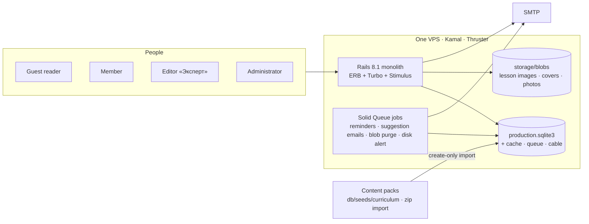

# Architecture

A majestic monolith on one small VPS: Rails 8.1, SQLite on one disk, Solid
Queue/Cache/Cable, Hotwire, Kamal. No Node, no S3, no paid SaaS — see the north star in
[AGENTS.md](../AGENTS.md).

## Subsystems

- [Content model](conventions/content-model.md) — Path → Course → stage → Lesson, invariants, importer.
- [Profession hub](architecture/profession-hub.md) — the five tabs, landing, glossary, library, projects, calculators.
- [Learning loop](architecture/learning-loop.md) — completion, dashboard, journal, the one retention email.
- [Editing pipeline](architecture/editing-pipeline.md) — suggestions → review → immutable revisions, attribution.
- [Accounts and roles](architecture/accounts-and-roles.md) — signup, trust ladder, grants, suspension, profiles.
- [Personal maps](architecture/personal-maps.md) — overlays on a profession, never copies.
- [Search and palette](architecture/search-and-palette.md) — FTS5 and Ctrl+K.
- [Admin and operations](architecture/admin-and-operations.md) — dashboard, action log, feedback, errors, analytics.

For *when* and the full rationale, use git history; for the forward roadmap, see
[VISION → Roadmap & scope](VISION.md#roadmap--scope).
