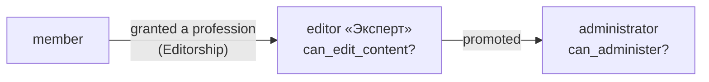

# Accounts and roles

Hand-rolled auth à la Writebook: `has_secure_password`, `Session` with a signed
permanent cookie, `Current` + the `Authentication` concern. No Devise, no second login
mechanism, no HTTP Basic.

- **Signup** (Fizzy pattern): email → 6-char code (15 min) → name + password. `Signup`
  is a PORO; the `User` is created only at the final step. **Production signup
  requires SMTP.** Login stays password-based on purpose; a founder welcome `<dialog>`
  follows signup.
- **Password reset**: `generates_token_for` + `PasswordsController` + mailer.
- **Trust ladder**: `Editorship` scopes editor rights to granted professions; admins edit
  everything and need no grant; only admins publish; an admin can't change their own role.
  First admin comes from `ADMIN_EMAIL`/`ADMIN_PASSWORD` in the seed.
- **A grant is a public role**: every active grant holder is named on the map («Карту
  ведёт», lesson byline, JSON-LD `reviewedBy`); the «Проверено» mark carries the
  verifier's name and date. A map is never anonymous.
- **Suspension**: `users.suspended_at`; `suspend!` revokes sessions and
  `User.active.authenticate_by` blocks login; `reinstate!` reverses; self-suspend guard.
  No durations, IP or partial blocks.
- **Public profiles** (`/u/:handle`): a visiting card, not a social layer — name,
  self-labelled headline, role mark, joined month, the personal map, curated professions,
  accepted edits; learning progress only when `users.show_progress`. The handle is
  generated on first map creation and editable in account settings. No karma, badges or
  followers.
- **Photos**: generated-initials avatars for everyone; grant holders may upload a photo
  (`User::Photo`: one 256px WebP, EXIF stripped, original discarded). Members have none
  ([decision](../decisions/2026-06-24-no-uploads-on-private-models.md)).
