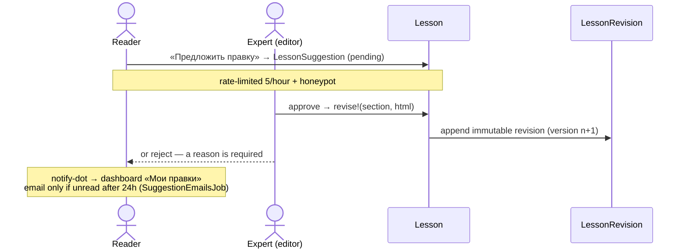

# Editing pipeline

How content improves without the founder: any reader proposes, an expert decides,
every applied change is kept forever.

- **Suggestions** (`LessonSuggestion`, `ResourceSuggestion`) share
  `SuggestionModeration`: `pending | approved | rejected`. Rejection always carries a
  reviewer comment.
- **Revisions** are append-only (`LessonRevision#readonly?` once persisted). Rollback
  is a new revision, never a rewrite. Readers see history at `/lessons/:slug/revisions`
  with word-level diffs (`RevisionDiff`).
- **Attribution, not competition**: a muted «Статью улучшили» credit from revisions;
  the founder's direct edits store `editor_name: nil`. `TrackRecord` powers the
  profile's accepted edits. No leaderboard ([decision](../decisions/2026-06-24-no-leaderboard.md)).
- Approvals and rejections are also written to the [admin action log](admin-and-operations.md).
- An approval that raises the profession's maturity stage is recorded on the
  suggestion (`raised_path_stage`) so the author hears about it.
- A revised lesson is frozen for re-import (`Revisable#frozen_for_import?`) — see
  [content model](../conventions/content-model.md#seed-loader-and-packs).
