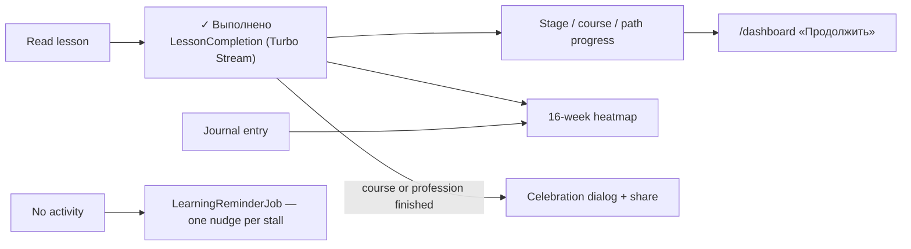

# Learning loop

Odin-style: a lesson is done or not done. Nothing in between.

- **Completion**: `LessonCompletion` unique per user + lesson; the row existing = done.
  Progress = completed / total.
- **Dashboard**: the learner's goal, continue links, bookmarks, personal maps, «Мои
  правки». New directions are offered only to someone who hasn't started one.
- **Focus direction**: `User#focus_path` is derived from the latest completion — no stored
  setting. It drives the dashboard hero, catalog banner and `/projects` sort. Defaults,
  not walls.
- **Practice journal** (`/journal`): private, **text-only** work log, optional lesson
  link, rate-limited. The heatmap counts completions + journal entries.
- **Retention email — the one**: `LearningReminderJob` (daily recurring) nudges a stalled
  learner once per stall, never a drip. Opt-out plus one-click unsubscribe (RFC 8058).
  **No more lifecycle emails without an explicit founder decision.**
- **Milestone dialog**: finishing a course or profession opens a celebration `<dialog>`
  via the completion stream — the one honest share moment; a section keeps the quiet flash.
