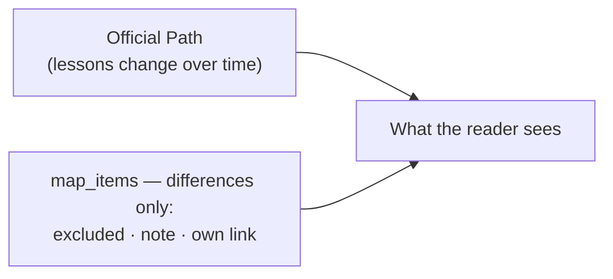

# Personal maps

One `Map` per member (`/map`, public at `/u/:handle/map`) — an **overlay on a
profession, never a copy of it**.

- Creating a map writes no `map_items`. A row exists only for a difference: a lesson
  taken off (`excluded`), a comment under a kept lesson (`note`), or the author's own
  link (`after_lesson_id`, or loose).
- So a lesson added to the profession appears on every map built from it, progress and
  review stay single, and per-user disk stays flat.
- The editor wears the expert builder's look (`builder.css`); JS is only «Все · Ничего»
  and a live count (`checklist_controller`). Disclosure and the pencil toggle are native
  `
` and a hidden checkbox + `:has()`. Text only.
- Public by link, never listed: `noindex`, `rel="nofollow ugc"` on user links, gone with a
  suspended account.
- A reader «takes» a map (`MapFollow`) onto their dashboard; the author sees only a count.
- This is the sandbox half of [sandbox + promotion](../decisions/2026-07-31-no-community-maps-shelf.md);
  «предложить в каталог» is not built.
