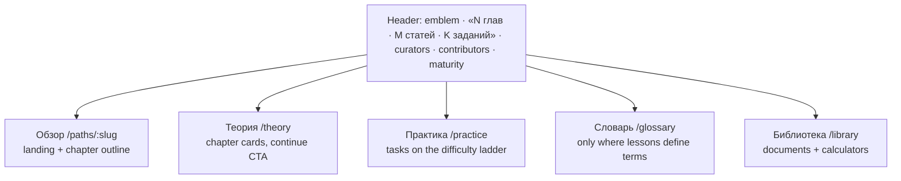

# Profession hub

- **Landing «О профессии»** (`Path::Landing`): six slots in one JSON column
  (`paths.landing`: about/history/faq markdown; highlights/pros/cons line lists) +
  `has_one_attached :cover` (also the og:image). Carried by packs as `landing.yml` +
  `cover.*`; frozen by an expert's edit, but an empty landing is filled even on a
  human-owned profession (`Path#fill_landing`). National specifics live in prose; a new
  slot becomes code only when two professions ask.
- **Glossary**: `GlossaryTerm` rows are owned by the lesson that explains each term,
  edited next to its links, `terms:` in pack frontmatter.
- `Path::Progress` is the per-reader null object the hub reads — no `Current.user`
  branching in views.
- The old `?path=` views of `/projects`, `/resources`, `/glossary` 301 into the hub; the
  site-wide pages stay in the footer and palette. Every tab ends in «Улучшить карту».
- **Projects** (`/projects`): all `kind: practice` lessons across published paths with
  difficulty filters.
- **Calculators** (`/calculators`): a code registry (no DB) + one Stimulus controller for
  all the math.
- **Resources** carry `country_code` (nil = universal) — one lesson, different documents
  per country.
