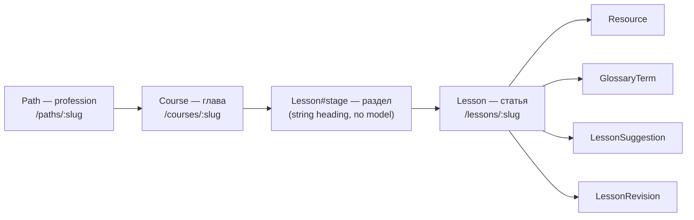

# Content model

Four levels, exact parity with The Odin Project:

A `Course` can be `coming_soon` (a specialization stub inside a real profession).
`Path` statuses are only `draft | pending_review | published` — an unwritten
profession is locale copy, never an empty `Path` (see
[decision](../decisions/2026-07-16-unwritten-profession-is-copy.md)).

## Invariants — don't "fix" these

- **`lessons.path_id` is a denormalized FK** (= `course.path`), synced in `Lesson`'s
  `before_validation`. Hot queries join it; lessons never change course, so it
  can't drift. Not a `has_many :through`.
- **`lesson.position` is global within the profession**, not per course — keeps
  `prev_in_path`/`next_in_path` and «Продолжить» flowing across courses while the
  sidebar is scoped to the current course.
- **Course owns lessons.** `Path → courses → lessons` are `dependent: :destroy`;
  `Path has_many :lessons` has NO dependent option (else lessons destroy twice).
  Both `belongs_to` use counter_cache.
- **No per-lesson draft status** — see
  [decision](../decisions/2026-07-11-lessons-have-no-draft-status.md).
- **`Lesson.slug` is globally unique.**
- Lesson body/description/task are ActionText rich text with a plain markdown
  column as fallback.

## Seed loader and packs

- Walks `<path>/path.yml` → `<NN>-<course>/course.yml` → `<MM>-<section>/section.yml`
  (title → `stage`) → `<lesson>.md`; assigns global position by walk order.
- **Create-only / update-if-pristine**: the DB is the source of truth, not YAML. A
  human edit freezes the row; a re-import never overwrites it. The idempotent seed
  won't change an existing slug — destroy the path to re-seed.
- `icon:` in `path.yml`/`course.yml` is create-only and not in `IMPORTABLE_FIELDS`;
  an unknown name is dropped with a line in the import report.
- `bin/rails content:export[slug]` (`CurriculumExporter`) writes a profession back into
  the exact tree the importer reads — round-trip covered by tests; drag-reordered stages
  split into consecutive same-title dirs so import reproduces order.
- The pack format is a public contract: `tools/PACK_FORMAT.md`. The factory
  workflow: `tools/CONTENT_FACTORY.md`.
